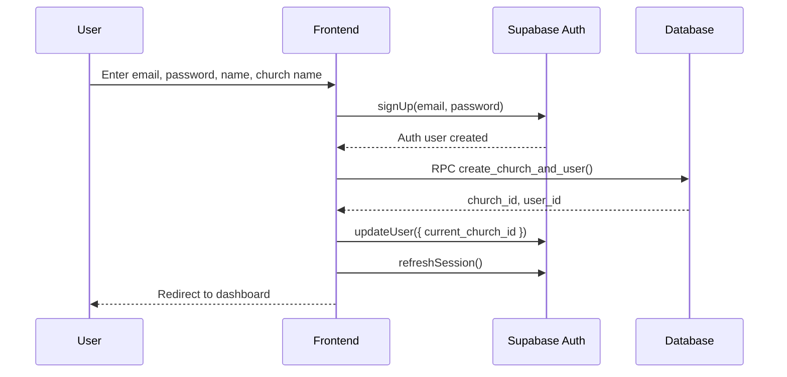
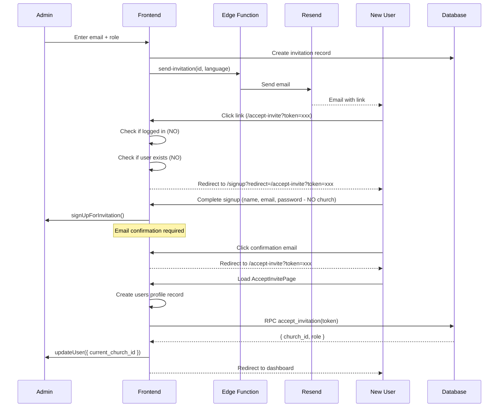
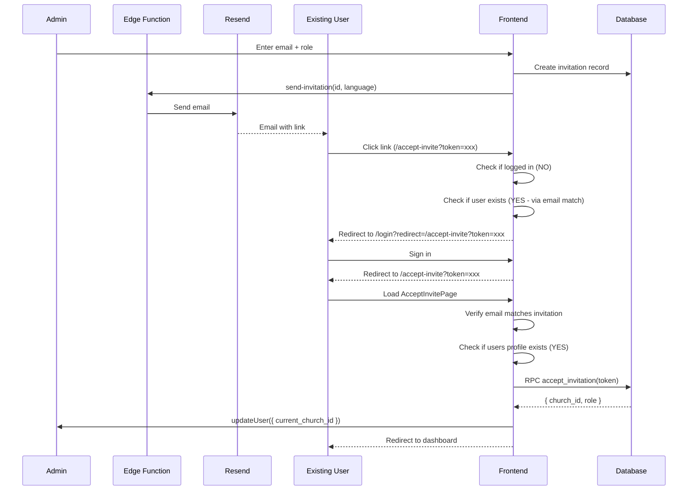
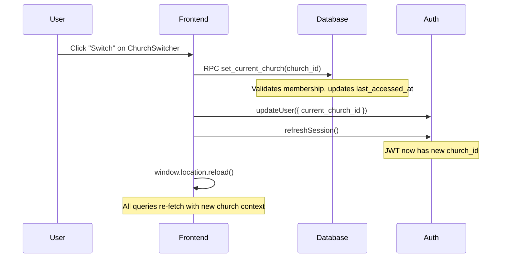
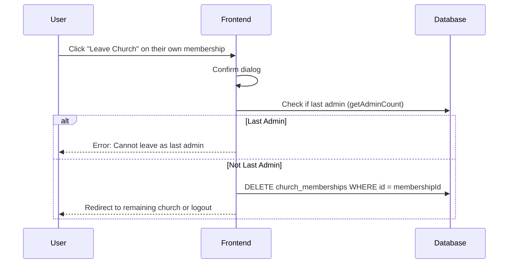
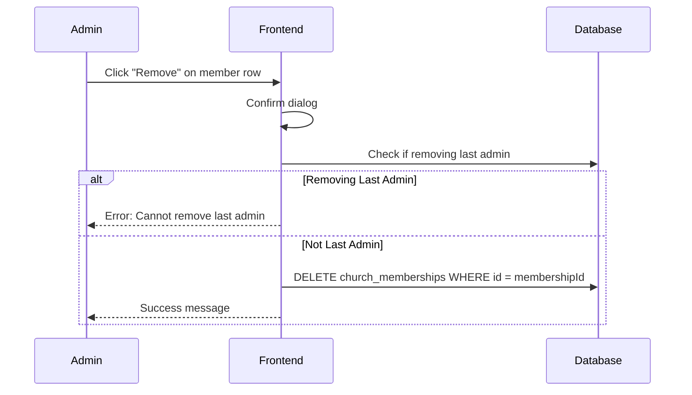
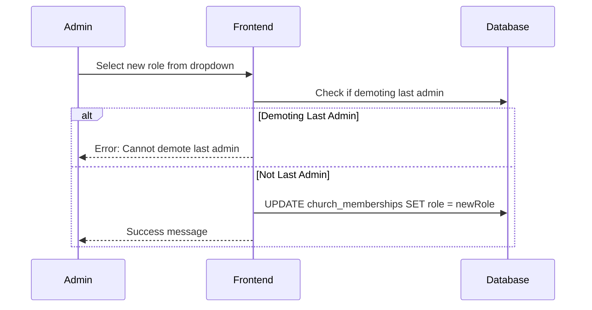

# Multi-Tenancy Requirements Document

This document describes the multi-tenancy system from the prior implementation at `/Users/markb/dev/mobileworship` to guide implementation in the new Mobile Worship app.

## Table of Contents

1. [Overview](#overview)
2. [Database Schema](#database-schema)
3. [User Roles and Permissions](#user-roles-and-permissions)
4. [Invitation System](#invitation-system)
5. [User Flows](#user-flows)
6. [Email Templates](#email-templates)
7. [Row Level Security (RLS)](#row-level-security-rls)
8. [Implementation Components](#implementation-components)
9. [i18n Considerations](#i18n-considerations)
10. [End-to-End Testing Plan](#end-to-end-testing-plan)
    - [Mail.tm API Integration](#101-mailtm-api-integration)
    - [Test User Factory](#102-test-user-factory)
    - [Test Scenarios](#103-test-scenarios)
    - [Playwright Configuration](#104-playwright-configuration)
    - [CI/CD Integration](#106-cicd-integration)

---

## Overview

The multi-tenancy system enables:
- Users to belong to multiple churches with different roles
- Church-scoped data isolation via Row Level Security (RLS)
- Email-based invitation workflow with token-based acceptance
- Role-based permissions (admin, editor, operator)
- Church switching for users with multiple memberships

### Tech Stack (Prior Implementation)
- **Backend**: Supabase (PostgreSQL, Auth, RLS, Edge Functions)
- **Email Service**: Resend API
- **State Management**: TanStack Query (React Query)
- **i18n**: react-i18next (English + Spanish)

---

## Database Schema

### 1. `church_memberships` Table

Many-to-many relationship between users and churches.

```sql
CREATE TABLE church_memberships (
  id UUID PRIMARY KEY DEFAULT gen_random_uuid(),
  user_id UUID NOT NULL REFERENCES auth.users ON DELETE CASCADE,
  church_id UUID NOT NULL REFERENCES churches ON DELETE CASCADE,
  role TEXT NOT NULL DEFAULT 'operator' CHECK (role IN ('admin', 'editor', 'operator')),
  last_accessed_at TIMESTAMPTZ DEFAULT NOW(),
  created_at TIMESTAMPTZ DEFAULT NOW(),
  UNIQUE(user_id, church_id)
);

-- Indexes
CREATE INDEX idx_memberships_user ON church_memberships(user_id);
CREATE INDEX idx_memberships_church ON church_memberships(church_id);
CREATE INDEX idx_memberships_church_role ON church_memberships(church_id, role);
```

### 2. `invitations` Table

Stores pending invitations with unique tokens.

```sql
CREATE TABLE invitations (
  id UUID PRIMARY KEY DEFAULT gen_random_uuid(),
  church_id UUID NOT NULL REFERENCES churches ON DELETE CASCADE,
  email TEXT NOT NULL,
  role TEXT NOT NULL DEFAULT 'operator' CHECK (role IN ('admin', 'editor', 'operator')),
  invited_by UUID NOT NULL REFERENCES auth.users,
  token UUID NOT NULL UNIQUE DEFAULT gen_random_uuid(),
  expires_at TIMESTAMPTZ NOT NULL DEFAULT (NOW() + INTERVAL '30 days'),
  accepted_at TIMESTAMPTZ,
  created_at TIMESTAMPTZ DEFAULT NOW()
);

-- Indexes
CREATE INDEX idx_invitations_church ON invitations(church_id);
CREATE INDEX idx_invitations_email ON invitations(email);
CREATE INDEX idx_invitations_token ON invitations(token);
```

### 3. `users` Table Update

The users table no longer stores `church_id` or `role` - those are in `church_memberships`.

```sql
CREATE TABLE users (
  id UUID PRIMARY KEY REFERENCES auth.users ON DELETE CASCADE,
  name TEXT NOT NULL,
  email TEXT NOT NULL,
  created_at TIMESTAMPTZ DEFAULT NOW()
);
```

### 4. Helper Functions

```sql
-- Get current church from JWT user metadata
CREATE OR REPLACE FUNCTION get_current_church_id()
RETURNS UUID AS $$
  SELECT (auth.jwt() -> 'user_metadata' ->> 'current_church_id')::UUID;
$$ LANGUAGE SQL STABLE;

-- Get current role from membership
CREATE OR REPLACE FUNCTION get_current_role()
RETURNS TEXT AS $$
  SELECT role FROM church_memberships
  WHERE user_id = auth.uid()
  AND church_id = get_current_church_id();
$$ LANGUAGE SQL STABLE;

-- Get admin count for a church (for last-admin validation)
CREATE OR REPLACE FUNCTION get_admin_count(p_church_id UUID)
RETURNS INTEGER AS $$
  SELECT COUNT(*)::INTEGER FROM church_memberships
  WHERE church_id = p_church_id AND role = 'admin';
$$ LANGUAGE SQL STABLE;

-- Validate and set current church
CREATE OR REPLACE FUNCTION set_current_church(p_church_id UUID)
RETURNS BOOLEAN AS $$
DECLARE
  v_is_member BOOLEAN;
BEGIN
  SELECT EXISTS(
    SELECT 1 FROM church_memberships
    WHERE user_id = auth.uid() AND church_id = p_church_id
  ) INTO v_is_member;

  IF NOT v_is_member THEN
    RAISE EXCEPTION 'User is not a member of this church';
  END IF;

  UPDATE church_memberships
  SET last_accessed_at = NOW()
  WHERE user_id = auth.uid() AND church_id = p_church_id;

  RETURN TRUE;
END;
$$ LANGUAGE plpgsql SECURITY DEFINER;

-- Accept invitation RPC function
CREATE OR REPLACE FUNCTION accept_invitation(p_token UUID)
RETURNS JSON AS $$
DECLARE
  v_invitation RECORD;
  v_user_email TEXT;
  v_result JSON;
BEGIN
  SELECT email INTO v_user_email FROM auth.users WHERE id = auth.uid();

  SELECT * INTO v_invitation FROM invitations
  WHERE token = p_token
  AND email = v_user_email
  AND accepted_at IS NULL
  AND expires_at > NOW();

  IF v_invitation IS NULL THEN
    RAISE EXCEPTION 'Invalid or expired invitation';
  END IF;

  IF EXISTS(
    SELECT 1 FROM church_memberships
    WHERE user_id = auth.uid() AND church_id = v_invitation.church_id
  ) THEN
    RAISE EXCEPTION 'Already a member of this church';
  END IF;

  INSERT INTO church_memberships (user_id, church_id, role)
  VALUES (auth.uid(), v_invitation.church_id, v_invitation.role);

  UPDATE invitations SET accepted_at = NOW() WHERE id = v_invitation.id;

  SELECT json_build_object(
    'church_id', v_invitation.church_id,
    'role', v_invitation.role
  ) INTO v_result;

  RETURN v_result;
END;
$$ LANGUAGE plpgsql SECURITY DEFINER;

-- Create church and user (for signup)
CREATE OR REPLACE FUNCTION create_church_and_user(
  p_user_id UUID,
  p_church_name TEXT,
  p_user_name TEXT,
  p_user_email TEXT
)
RETURNS JSON AS $$
DECLARE
  v_church_id UUID;
  v_result JSON;
BEGIN
  INSERT INTO churches (name)
  VALUES (p_church_name)
  RETURNING id INTO v_church_id;

  INSERT INTO users (id, name, email)
  VALUES (p_user_id, p_user_name, p_user_email)
  ON CONFLICT (id) DO UPDATE SET name = p_user_name;

  INSERT INTO church_memberships (user_id, church_id, role)
  VALUES (p_user_id, v_church_id, 'admin');

  SELECT json_build_object(
    'church_id', v_church_id,
    'user_id', p_user_id
  ) INTO v_result;

  RETURN v_result;
END;
$$ LANGUAGE plpgsql SECURITY DEFINER;

-- Delete church function
CREATE OR REPLACE FUNCTION delete_church(p_church_id UUID, p_confirmation TEXT)
RETURNS BOOLEAN AS $$
DECLARE
  v_church_name TEXT;
  v_member_count INTEGER;
BEGIN
  IF get_current_role() != 'admin' THEN
    RAISE EXCEPTION 'Only admins can delete a church';
  END IF;

  SELECT name INTO v_church_name FROM churches WHERE id = p_church_id;
  SELECT COUNT(*) INTO v_member_count FROM church_memberships WHERE church_id = p_church_id;

  IF v_member_count > 1 THEN
    RAISE EXCEPTION 'Cannot delete church with other members';
  END IF;

  IF p_confirmation != v_church_name THEN
    RAISE EXCEPTION 'Confirmation does not match church name';
  END IF;

  DELETE FROM churches WHERE id = p_church_id;

  RETURN TRUE;
END;
$$ LANGUAGE plpgsql SECURITY DEFINER;
```

---

## User Roles and Permissions

### Role Definitions

| Role | Description |
|------|-------------|
| **admin** | Full access including billing, user management, church settings |
| **editor** | Can manage songs, media, events; can control presentations |
| **operator** | Can view content and control live presentations only |

### Permission Matrix

```typescript
type Role = 'admin' | 'editor' | 'operator';

type Permission =
  | 'church:manage'      // Church settings
  | 'church:users'       // User/invitation management
  | 'songs:read'         // View songs
  | 'songs:write'        // Create/edit/delete songs
  | 'media:read'         // View media
  | 'media:write'        // Upload/delete media
  | 'events:read'        // View events
  | 'events:write'       // Create/edit/delete events
  | 'control:operate'    // Control live presentations
  | 'integrations:manage'; // CCLI, Planning Center, etc.

const ROLE_PERMISSIONS: Record<Role, Permission[]> = {
  admin: [
    'church:manage',
    'church:users',
    'songs:read',
    'songs:write',
    'media:read',
    'media:write',
    'events:read',
    'events:write',
    'control:operate',
    'integrations:manage',
  ],
  editor: [
    'songs:read',
    'songs:write',
    'media:read',
    'media:write',
    'events:read',
    'events:write',
    'control:operate',
  ],
  operator: [
    'songs:read',
    'media:read',
    'events:read',
    'control:operate'
  ],
};
```

### Permission Checking

```typescript
function hasPermission(role: Role, permission: Permission): boolean {
  return ROLE_PERMISSIONS[role]?.includes(permission) ?? false;
}

// In useAuth hook
function can(permission: Permission): boolean {
  if (!user) return false;
  return hasPermission(user.role, permission);
}

// Usage
const { can } = useAuth();
if (can('church:users')) {
  // Show team management UI
}
```

---

## Invitation System

### Invitation Lifecycle

1. **Creation**: Admin enters email and selects role
2. **Validation**: System checks if user is already a member or has pending invite
3. **Storage**: Invitation saved with unique token, 30-day expiration
4. **Email**: Edge function sends invitation email via Resend
5. **Acceptance**: User clicks link, authenticates, and accepts

### Invitation States

```typescript
type InvitationStatus = 'pending' | 'expired' | 'accepted';

function getInvitationStatus(invitation: Invitation): InvitationStatus {
  if (invitation.acceptedAt) return 'accepted';
  if (new Date(invitation.expiresAt) < new Date()) return 'expired';
  return 'pending';
}
```

### Creating Invitations (Frontend)

```typescript
const createInvitationMutation = useMutation({
  mutationFn: async ({ email, role }: { email: string; role: Role }) => {
    // 1. Check if user exists and is already a member
    const { data: existingUser } = await supabase
      .from('users')
      .select('id')
      .eq('email', email)
      .maybeSingle();

    if (existingUser) {
      const { data: existingMember } = await supabase
        .from('church_memberships')
        .select('id')
        .eq('church_id', user!.churchId)
        .eq('user_id', existingUser.id)
        .maybeSingle();

      if (existingMember) {
        throw new Error('User is already a member of this church');
      }
    }

    // 2. Check for pending invitation
    const { data: existingInvite } = await supabase
      .from('invitations')
      .select('id')
      .eq('church_id', user!.churchId)
      .eq('email', email)
      .is('accepted_at', null)
      .gt('expires_at', new Date().toISOString())
      .maybeSingle();

    if (existingInvite) {
      throw new Error('An invitation is already pending for this email');
    }

    // 3. Create invitation
    const { data, error } = await supabase
      .from('invitations')
      .insert({
        church_id: user!.churchId,
        email,
        role,
        invited_by: user!.id,
      })
      .select()
      .single();

    if (error) throw error;

    // 4. Send email via Edge Function
    await supabase.functions.invoke('send-invitation', {
      body: {
        invitationId: data.id,
        language: localStorage.getItem('i18nextLng') || 'en',
      },
    });

    return data;
  },
});
```

### Resending Invitations

```typescript
const resendInvitationMutation = useMutation({
  mutationFn: async (invitationId: string) => {
    // Extend expiration by 30 days
    const newExpiry = new Date();
    newExpiry.setDate(newExpiry.getDate() + 30);

    await supabase
      .from('invitations')
      .update({ expires_at: newExpiry.toISOString() })
      .eq('id', invitationId);

    // Resend email
    await supabase.functions.invoke('send-invitation', {
      body: {
        invitationId,
        language: localStorage.getItem('i18nextLng') || 'en',
      },
    });
  },
});
```

### Canceling Invitations

```typescript
const cancelInvitationMutation = useMutation({
  mutationFn: async (invitationId: string) => {
    await supabase
      .from('invitations')
      .delete()
      .eq('id', invitationId);
  },
});
```

---

## User Flows

### Flow 1: Regular Signup (New User + New Church)



**Key Points:**
- Creates auth user, users profile, church, and admin membership in one flow
- JWT metadata `current_church_id` set immediately
- User is first admin of their new church

### Flow 2: Invitation for NEW User (No Account)



**Key Points:**
- `signUpForInvitation()` doesn't create church or users profile
- Users profile created in AcceptInvitePage after email confirmation
- User's name stored in JWT metadata during signup, used when creating profile

### Flow 3: Invitation for EXISTING User (Has Account)



**Key Points:**
- Existing users go to login instead of signup
- No need to create users profile (already exists)
- Email must match invitation email (validated in AcceptInvitePage)

### Flow 4: Switching Churches



**Key Points:**
- `set_current_church` validates user is actually a member
- Full page reload ensures all TanStack Query caches refresh
- `last_accessed_at` updated for church switcher ordering

### Flow 5: Leaving a Church (Self-Removal)



### Flow 6: Removing a Member (Admin Action)



### Flow 7: Changing Member Role



---

## Email Templates

### Edge Function Structure

Location: `supabase/functions/send-invitation/index.ts`

```typescript
interface SendInvitationRequest {
  invitationId: string;
  language?: 'en' | 'es';
}

const translations = {
  en: {
    subject: (churchName: string) =>
      `You've been invited to join ${churchName} on Mobile Worship`,
    heading: "You're Invited!",
    message: (inviterName: string, churchName: string, article: string, role: string) =>
      `<strong>${inviterName}</strong> has invited you to join <strong>${churchName}</strong> on Mobile Worship as ${article} <strong>${role}</strong>.`,
    button: 'Accept Invitation',
    expires: (date: string) => `This invitation expires on ${date}.`,
    ignore: "If you didn't expect this invitation, you can safely ignore this email.",
    tagline: 'Mobile Worship - Worship lyrics display for churches',
  },
  es: {
    subject: (churchName: string) =>
      `Has sido invitado a unirte a ${churchName} en Mobile Worship`,
    heading: '¡Estás Invitado!',
    message: (inviterName: string, churchName: string, _article: string, role: string) =>
      `<strong>${inviterName}</strong> te ha invitado a unirte a <strong>${churchName}</strong> en Mobile Worship como <strong>${role}</strong>.`,
    button: 'Aceptar Invitación',
    expires: (date: string) => `Esta invitación expira el ${date}.`,
    ignore: 'Si no esperabas esta invitación, puedes ignorar este correo.',
    tagline: 'Mobile Worship - Letras de adoración para iglesias',
  },
};

const roleNames = {
  en: { admin: 'Admin', editor: 'Editor', operator: 'Operator' },
  es: { admin: 'Administrador', editor: 'Editor', operator: 'Operador' },
};
```

### Email Content

The email includes:
1. **Subject**: Personalized with church name
2. **Header**: Mobile Worship branding
3. **Heading**: "You're Invited!" / "¡Estás Invitado!"
4. **Message**: Who invited, which church, what role
5. **CTA Button**: Links to `/accept-invite?token=xxx`
6. **Expiration Notice**: Date formatted per locale
7. **Footer**: Ignore notice + tagline

### Authorization Check

The edge function verifies:
1. User is authenticated (via Authorization header)
2. User is a member of the invitation's church
3. User has admin role in that church

---

## Row Level Security (RLS)

### Church Memberships Policies

```sql
ALTER TABLE church_memberships ENABLE ROW LEVEL SECURITY;

-- Users can view their own memberships (for church list)
CREATE POLICY "View own memberships" ON church_memberships
  FOR SELECT USING (user_id = auth.uid());

-- Users can view memberships in churches they belong to
CREATE POLICY "View memberships in my churches" ON church_memberships
  FOR SELECT USING (
    church_id IN (SELECT church_id FROM church_memberships WHERE user_id = auth.uid())
  );

-- Admins can insert memberships in their current church
CREATE POLICY "Admins insert memberships" ON church_memberships
  FOR INSERT WITH CHECK (
    church_id = get_current_church_id()
    AND get_current_role() = 'admin'
  );

-- Admins can update memberships in their current church
CREATE POLICY "Admins update memberships" ON church_memberships
  FOR UPDATE USING (
    church_id = get_current_church_id()
    AND get_current_role() = 'admin'
  );

-- Admins or self can delete memberships
CREATE POLICY "Admins or self delete memberships" ON church_memberships
  FOR DELETE USING (
    user_id = auth.uid() OR
    (church_id = get_current_church_id() AND get_current_role() = 'admin')
  );
```

### Invitations Policies

```sql
ALTER TABLE invitations ENABLE ROW LEVEL SECURITY;

-- Anyone can view invitation by token (needed for accept flow)
CREATE POLICY "View invitation by token" ON invitations
  FOR SELECT USING (TRUE);

-- Admins can view all invitations for their church
CREATE POLICY "Admins view church invitations" ON invitations
  FOR SELECT USING (
    church_id = get_current_church_id()
    AND get_current_role() = 'admin'
  );

-- Admins can insert/update/delete invitations for their church
CREATE POLICY "Admins insert invitations" ON invitations
  FOR INSERT WITH CHECK (
    church_id = get_current_church_id()
    AND get_current_role() = 'admin'
  );

CREATE POLICY "Admins update invitations" ON invitations
  FOR UPDATE USING (
    church_id = get_current_church_id()
    AND get_current_role() = 'admin'
  );

CREATE POLICY "Admins delete invitations" ON invitations
  FOR DELETE USING (
    church_id = get_current_church_id()
    AND get_current_role() = 'admin'
  );
```

### Churches Policies

```sql
-- View churches user is a member of
CREATE POLICY "View member churches" ON churches
  FOR SELECT USING (
    id IN (SELECT church_id FROM church_memberships WHERE user_id = auth.uid())
  );

-- View church with pending invitation
CREATE POLICY "View church with pending invitation" ON churches
  FOR SELECT USING (
    id IN (
      SELECT church_id FROM invitations
      WHERE email = (SELECT email FROM auth.users WHERE id = auth.uid())
      AND accepted_at IS NULL
      AND expires_at > NOW()
    )
  );

-- Admins can update their current church
CREATE POLICY "Admins update church" ON churches
  FOR UPDATE USING (
    id = get_current_church_id()
    AND get_current_role() = 'admin'
  );

-- Sole member admin can delete church
CREATE POLICY "Sole member delete church" ON churches
  FOR DELETE USING (
    id = get_current_church_id()
    AND get_current_role() = 'admin'
    AND (SELECT COUNT(*) FROM church_memberships WHERE church_id = id) = 1
  );
```

### Data Tables Policies Pattern

All church-scoped tables (songs, media, events, etc.) follow this pattern:

```sql
-- All users can view data in current church
CREATE POLICY "View [resource] in current church" ON [table]
  FOR SELECT USING (church_id = get_current_church_id());

-- Editors and admins can manage data
CREATE POLICY "Editors manage [resource]" ON [table]
  FOR ALL USING (
    church_id = get_current_church_id()
    AND get_current_role() IN ('admin', 'editor')
  );
```

---

## Implementation Components

### React Hooks

#### `useAuth` Hook

Provides authentication state and operations:

```typescript
interface AuthContextType {
  user: AuthUser | null;           // Current user with churchId and role
  isLoading: boolean;
  signIn: (email: string, password: string) => Promise<void>;
  signInWithGoogle: () => Promise<void>;
  signInWithMagicLink: (email: string) => Promise<void>;
  signUp: (email, password, name, churchName) => Promise<void>;
  signUpForInvitation: (email, password, name, redirectUrl) => Promise<void>;
  signOut: () => Promise<void>;
  resetPasswordForEmail: (email: string) => Promise<void>;
  updatePassword: (password: string) => Promise<void>;
  can: (permission: Permission) => boolean;
  switchChurch: (churchId: string) => Promise<void>;
  hasMultipleChurches: boolean;
}
```

#### `useMemberships` Hook

Manages church memberships:

```typescript
interface UseMembershipsReturn {
  myMemberships: ChurchMembership[];      // Current user's memberships
  isLoadingMyMemberships: boolean;
  churchMembers: ChurchMembership[];      // Members of current church
  isLoadingChurchMembers: boolean;
  changeRole: (params: { membershipId: string; newRole: Role }) => Promise<void>;
  isChangingRole: boolean;
  removeMember: (membershipId: string) => Promise<void>;
  isRemovingMember: boolean;
  getAdminCount: (churchId: string) => Promise<number>;
}
```

#### `useInvitations` Hook

Manages invitations:

```typescript
interface UseInvitationsReturn {
  invitations: Invitation[];
  isLoading: boolean;
  createInvitation: (params: { email: string; role: Role }) => Promise<Invitation>;
  isCreating: boolean;
  resendInvitation: (invitationId: string) => Promise<void>;
  isResending: boolean;
  cancelInvitation: (invitationId: string) => Promise<void>;
  isCanceling: boolean;
  acceptInvitation: (token: string) => Promise<{ church_id: string; role: string }>;
  isAccepting: boolean;
  getInvitationByToken: (token: string) => Promise<Invitation | null>;
}
```

### UI Components

#### `TeamSection` Component

Admin UI for managing members and invitations:
- Invite form with email input and role select
- Members list with role dropdown and remove button
- Pending invitations list with resend/cancel/copy-link buttons
- Validation for last admin protection

#### `ChurchSwitcher` Component

UI for users with multiple church memberships:
- Shows only if user has 2+ churches
- Lists all memberships with church name and role
- Highlights current church
- Switch button triggers church change + page reload

#### `AcceptInvitePage` Component

Handles invitation acceptance:
1. Validates token and invitation status
2. Redirects to login/signup if not authenticated
3. Creates user profile if needed (for new users)
4. Calls `accept_invitation` RPC
5. Updates JWT with new church
6. Redirects to dashboard

#### `SignupPage` Component

Handles both regular and invitation signups:
- Detects invitation context via `?redirect=/accept-invite?token=xxx`
- Hides church name field for invitation signups
- Pre-fills and locks email for invitation signups
- Calls appropriate signup function

---

## i18n Considerations

### Translation Keys (Team Management)

```json
{
  "settings.team.title": "Team Members",
  "settings.team.description": "Manage who has access to your church",
  "settings.team.members": "Members",
  "settings.team.invitations": "Pending Invitations",
  "settings.team.invite": "Invite Member",
  "settings.team.emailPlaceholder": "Enter email address",
  "settings.team.sendInvite": "Send Invitation",
  "settings.team.inviteSent": "Invitation sent successfully",
  "settings.team.alreadyMember": "User is already a member",
  "settings.team.alreadyInvited": "An invitation is already pending for this email",
  "settings.team.removeMember": "Remove Member",
  "settings.team.removeConfirm": "Are you sure you want to remove {{name}} from the team?",
  "settings.team.cannotRemoveLastAdmin": "Cannot remove the last admin",
  "settings.team.cannotDemoteLastAdmin": "Cannot demote the last admin",
  "settings.team.resendInvite": "Resend",
  "settings.team.cancelInvite": "Cancel",
  "settings.team.copyLink": "Copy Link",
  "settings.team.linkCopied": "Invitation link copied to clipboard",
  "settings.team.expires": "Expires {{date}}",
  "settings.team.expired": "Expired",
  "settings.team.you": "(you)",
  "settings.team.roles.admin": "Admin",
  "settings.team.roles.editor": "Editor",
  "settings.team.roles.operator": "Operator"
}
```

### Translation Keys (Church Switcher)

```json
{
  "settings.churchSwitcher.title": "Switch Church",
  "settings.churchSwitcher.currentChurch": "Current Church",
  "settings.churchSwitcher.switch": "Switch",
  "settings.churchSwitcher.switching": "Switching...",
  "settings.churchSwitcher.switchFailed": "Failed to switch church"
}
```

### Translation Keys (Invitation Acceptance)

```json
{
  "invite.title": "You're Invited",
  "invite.description": "{{churchName}} has invited you to join as {{role}}",
  "invite.accept": "Accept Invitation",
  "invite.accepting": "Accepting...",
  "invite.expired": "This invitation has expired",
  "invite.notFound": "Invitation not found",
  "invite.emailMismatch": "This invitation was sent to a different email address"
}
```

---

## Summary of Required Implementation

### Database
1. Create `church_memberships` table
2. Create `invitations` table
3. Update `users` table (remove church_id, role if present)
4. Create helper functions (get_current_church_id, get_current_role, etc.)
5. Create RPC functions (accept_invitation, set_current_church, create_church_and_user, delete_church)
6. Update all RLS policies to use new functions

### Edge Functions
1. Create `send-invitation` edge function with Resend integration
2. Add bilingual email templates (English/Spanish)

### Frontend - Hooks
1. Update `useAuth` with multi-church support
2. Create `useMemberships` hook
3. Create `useInvitations` hook

### Frontend - Components
1. Create `TeamSection` component
2. Create `ChurchSwitcher` component
3. Create `AcceptInvitePage` component
4. Update `SignupPage` for invitation flow

### Frontend - i18n
1. Add all team/invitation translation keys
2. Add Spanish translations

### Environment Variables
- `RESEND_API_KEY` - For sending invitation emails
- `APP_URL` - For building invitation links

---

## End-to-End Testing Plan

This section describes a comprehensive Playwright E2E testing strategy for all multi-tenancy features, using mail.tm for real email verification.

### 10.1 Mail.tm API Integration

[Mail.tm](https://mail.tm) provides disposable email addresses with API access, enabling automated email verification testing.

#### API Reference

| Endpoint | Method | Auth Required | Description |
|----------|--------|---------------|-------------|
| `/domains` | GET | No | Get available email domains |
| `/accounts` | POST | No | Create new email account |
| `/token` | POST | No | Get auth token |
| `/messages` | GET | Yes | List inbox messages |
| `/messages/{id}` | GET | Yes | Get full message content |
| `/messages/{id}` | DELETE | Yes | Delete message |

**Rate Limit**: 8 queries per second per IP

#### Test Email Helper Class

```typescript
// e2e/helpers/mail-tm.ts
import { expect } from '@playwright/test';

interface MailTmAccount {
  id: string;
  address: string;
  password: string;
  token: string;
}

interface MailTmMessage {
  id: string;
  from: { address: string; name: string };
  to: { address: string; name: string }[];
  subject: string;
  intro: string;
  text?: string;
  html?: string[];
  createdAt: string;
}

const MAIL_TM_API = 'https://api.mail.tm';

export class MailTmClient {
  private account: MailTmAccount | null = null;

  /**
   * Get available domains for email creation
   */
  async getAvailableDomains(): Promise<string[]> {
    const response = await fetch(`${MAIL_TM_API}/domains`);
    const data = await response.json();
    return data['hydra:member'].map((d: { domain: string }) => d.domain);
  }

  /**
   * Create a new disposable email account
   * @param prefix - Optional prefix for the email address
   * @returns The created account details
   */
  async createAccount(prefix?: string): Promise<MailTmAccount> {
    const domains = await this.getAvailableDomains();
    const domain = domains[0];
    const timestamp = Date.now();
    const random = Math.random().toString(36).substring(2, 8);
    const address = `${prefix || 'test'}_${timestamp}_${random}@${domain}`;
    const password = `TestPass123!${random}`;

    // Create account
    const createResponse = await fetch(`${MAIL_TM_API}/accounts`, {
      method: 'POST',
      headers: { 'Content-Type': 'application/json' },
      body: JSON.stringify({ address, password }),
    });

    if (!createResponse.ok) {
      const error = await createResponse.text();
      throw new Error(`Failed to create mail.tm account: ${error}`);
    }

    const accountData = await createResponse.json();

    // Get auth token
    const tokenResponse = await fetch(`${MAIL_TM_API}/token`, {
      method: 'POST',
      headers: { 'Content-Type': 'application/json' },
      body: JSON.stringify({ address, password }),
    });

    if (!tokenResponse.ok) {
      throw new Error('Failed to get mail.tm token');
    }

    const tokenData = await tokenResponse.json();

    this.account = {
      id: accountData.id,
      address,
      password,
      token: tokenData.token,
    };

    return this.account;
  }

  /**
   * Get the current account's email address
   */
  getEmail(): string {
    if (!this.account) throw new Error('No account created');
    return this.account.address;
  }

  /**
   * Wait for and retrieve an email matching the criteria
   * @param options - Search criteria and timeout
   * @returns The matching message
   */
  async waitForEmail(options: {
    subject?: string | RegExp;
    from?: string | RegExp;
    timeout?: number;
    pollInterval?: number;
  } = {}): Promise<MailTmMessage> {
    if (!this.account) throw new Error('No account created');

    const {
      subject,
      from,
      timeout = 60000,
      pollInterval = 2000
    } = options;

    const startTime = Date.now();

    while (Date.now() - startTime < timeout) {
      const messages = await this.getMessages();

      for (const msg of messages) {
        const subjectMatch = !subject ||
          (subject instanceof RegExp ? subject.test(msg.subject) : msg.subject.includes(subject));
        const fromMatch = !from ||
          (from instanceof RegExp ? from.test(msg.from.address) : msg.from.address.includes(from));

        if (subjectMatch && fromMatch) {
          // Fetch full message content
          return await this.getMessage(msg.id);
        }
      }

      // Wait before polling again
      await new Promise(resolve => setTimeout(resolve, pollInterval));
    }

    throw new Error(`Timeout waiting for email. Subject: ${subject}, From: ${from}`);
  }

  /**
   * Get all messages in inbox
   */
  async getMessages(): Promise<MailTmMessage[]> {
    if (!this.account) throw new Error('No account created');

    const response = await fetch(`${MAIL_TM_API}/messages`, {
      headers: { Authorization: `Bearer ${this.account.token}` },
    });

    if (!response.ok) {
      throw new Error('Failed to fetch messages');
    }

    const data = await response.json();
    return data['hydra:member'];
  }

  /**
   * Get full message content by ID
   */
  async getMessage(id: string): Promise<MailTmMessage> {
    if (!this.account) throw new Error('No account created');

    const response = await fetch(`${MAIL_TM_API}/messages/${id}`, {
      headers: { Authorization: `Bearer ${this.account.token}` },
    });

    if (!response.ok) {
      throw new Error('Failed to fetch message');
    }

    return await response.json();
  }

  /**
   * Extract links from email HTML content
   */
  extractLinks(message: MailTmMessage): string[] {
    const links: string[] = [];
    const html = message.html?.join('') || '';
    const linkRegex = /href=["']([^"']+)["']/g;
    let match;
    while ((match = linkRegex.exec(html)) !== null) {
      links.push(match[1]);
    }
    return links;
  }

  /**
   * Extract verification/confirmation link from email
   */
  extractVerificationLink(message: MailTmMessage): string | null {
    const links = this.extractLinks(message);
    // Look for common verification link patterns
    const verificationLink = links.find(link =>
      link.includes('/confirm') ||
      link.includes('/verify') ||
      link.includes('/auth/callback') ||
      link.includes('token=') ||
      link.includes('type=signup') ||
      link.includes('type=email_change')
    );
    return verificationLink || null;
  }

  /**
   * Extract invitation accept link from email
   */
  extractInvitationLink(message: MailTmMessage): string | null {
    const links = this.extractLinks(message);
    const inviteLink = links.find(link =>
      link.includes('/accept-invite') ||
      link.includes('token=')
    );
    return inviteLink || null;
  }

  /**
   * Delete the account (cleanup)
   */
  async deleteAccount(): Promise<void> {
    if (!this.account) return;

    await fetch(`${MAIL_TM_API}/accounts/${this.account.id}`, {
      method: 'DELETE',
      headers: { Authorization: `Bearer ${this.account.token}` },
    });

    this.account = null;
  }
}
```

### 10.2 Test User Factory

```typescript
// e2e/helpers/test-user-factory.ts
import { Page } from '@playwright/test';
import { MailTmClient } from './mail-tm';

export interface TestUser {
  email: string;
  password: string;
  name: string;
  mailClient: MailTmClient;
}

export interface TestChurch {
  name: string;
  admin: TestUser;
}

/**
 * Factory for creating test users with real email addresses
 */
export class TestUserFactory {
  private users: TestUser[] = [];

  /**
   * Create a new test user with a disposable email
   */
  async createUser(prefix: string = 'user'): Promise<TestUser> {
    const mailClient = new MailTmClient();
    const account = await mailClient.createAccount(prefix);

    const user: TestUser = {
      email: account.address,
      password: `TestPassword123!${Date.now()}`,
      name: `Test ${prefix} ${Date.now()}`,
      mailClient,
    };

    this.users.push(user);
    return user;
  }

  /**
   * Clean up all created users
   */
  async cleanup(): Promise<void> {
    for (const user of this.users) {
      await user.mailClient.deleteAccount();
    }
    this.users = [];
  }
}

/**
 * Page object helpers for auth actions
 */
export class AuthHelpers {
  constructor(private page: Page) {}

  /**
   * Sign up a new user and verify their email
   */
  async signUpAndVerify(user: TestUser, churchName?: string): Promise<void> {
    await this.page.goto('/signup');

    await this.page.fill('[name="name"]', user.name);
    await this.page.fill('[name="email"]', user.email);
    await this.page.fill('[name="password"]', user.password);

    if (churchName) {
      await this.page.fill('[name="churchName"]', churchName);
    }

    await this.page.click('button[type="submit"]');

    // Wait for "check your email" message
    await this.page.waitForSelector('text=Check Your Email', { timeout: 10000 });

    // Wait for and click verification email
    const verificationEmail = await user.mailClient.waitForEmail({
      subject: /confirm|verify/i,
      timeout: 60000,
    });

    const verificationLink = user.mailClient.extractVerificationLink(verificationEmail);
    if (!verificationLink) {
      throw new Error('Could not find verification link in email');
    }

    // Visit verification link
    await this.page.goto(verificationLink);

    // Should redirect to dashboard after verification
    await this.page.waitForURL('**/dashboard', { timeout: 10000 });
  }

  /**
   * Sign up for invitation (no church)
   */
  async signUpForInvitation(user: TestUser, redirectUrl: string): Promise<void> {
    await this.page.goto(`/signup?redirect=${encodeURIComponent(redirectUrl)}`);

    await this.page.fill('[name="name"]', user.name);
    // Email should be pre-filled and locked for invitation signups
    await this.page.fill('[name="password"]', user.password);

    await this.page.click('button[type="submit"]');

    // Wait for "check your email" message
    await this.page.waitForSelector('text=Check Your Email', { timeout: 10000 });

    // Wait for verification email
    const verificationEmail = await user.mailClient.waitForEmail({
      subject: /confirm|verify/i,
      timeout: 60000,
    });

    const verificationLink = user.mailClient.extractVerificationLink(verificationEmail);
    if (!verificationLink) {
      throw new Error('Could not find verification link in email');
    }

    // Visit verification link - should redirect to accept-invite page
    await this.page.goto(verificationLink);
  }

  /**
   * Sign in an existing user
   */
  async signIn(user: TestUser): Promise<void> {
    await this.page.goto('/login');

    await this.page.fill('[name="email"]', user.email);
    await this.page.fill('[name="password"]', user.password);

    await this.page.click('button[type="submit"]');

    // Wait for dashboard
    await this.page.waitForURL('**/dashboard', { timeout: 10000 });
  }

  /**
   * Sign out current user
   */
  async signOut(): Promise<void> {
    // Click user menu or sign out button
    await this.page.click('[data-testid="sign-out-button"]');
    await this.page.waitForURL('**/login', { timeout: 5000 });
  }
}

/**
 * Page object helpers for team/invitation actions
 */
export class TeamHelpers {
  constructor(private page: Page) {}

  /**
   * Navigate to team settings
   */
  async goToTeamSettings(): Promise<void> {
    await this.page.goto('/settings');
    await this.page.click('text=Team Members');
  }

  /**
   * Send an invitation to a user
   */
  async sendInvitation(email: string, role: 'admin' | 'editor' | 'operator'): Promise<void> {
    await this.page.fill('[placeholder*="email" i]', email);
    await this.page.selectOption('select', role);
    await this.page.click('text=Send Invitation');

    // Wait for success message
    await this.page.waitForSelector('text=Invitation sent', { timeout: 10000 });
  }

  /**
   * Cancel a pending invitation
   */
  async cancelInvitation(email: string): Promise<void> {
    const invitationRow = this.page.locator(`text=${email}`).locator('..');
    await invitationRow.locator('text=Cancel').click();
    await this.page.waitForSelector('text=Invitation canceled', { timeout: 5000 });
  }

  /**
   * Resend an invitation
   */
  async resendInvitation(email: string): Promise<void> {
    const invitationRow = this.page.locator(`text=${email}`).locator('..');
    await invitationRow.locator('text=Resend').click();
    await this.page.waitForSelector('text=Invitation resent', { timeout: 5000 });
  }

  /**
   * Copy invitation link
   */
  async copyInvitationLink(email: string): Promise<string> {
    const invitationRow = this.page.locator(`text=${email}`).locator('..');
    const tokenAttr = await invitationRow.locator('[data-invitation-token]').getAttribute('data-invitation-token');
    return `/accept-invite?token=${tokenAttr}`;
  }

  /**
   * Change a member's role
   */
  async changeMemberRole(email: string, newRole: 'admin' | 'editor' | 'operator'): Promise<void> {
    const memberRow = this.page.locator(`text=${email}`).locator('..');
    await memberRow.locator('select').selectOption(newRole);
    await this.page.waitForSelector('text=Role updated', { timeout: 5000 });
  }

  /**
   * Remove a member
   */
  async removeMember(email: string): Promise<void> {
    const memberRow = this.page.locator(`text=${email}`).locator('..');
    await memberRow.locator('text=Remove').click();

    // Confirm dialog
    await this.page.click('text=Confirm');
    await this.page.waitForSelector('text=Member removed', { timeout: 5000 });
  }

  /**
   * Get member count
   */
  async getMemberCount(): Promise<number> {
    const members = await this.page.locator('[data-testid="member-row"]').count();
    return members;
  }

  /**
   * Get pending invitation count
   */
  async getPendingInvitationCount(): Promise<number> {
    const invitations = await this.page.locator('[data-testid="invitation-row"]').count();
    return invitations;
  }
}

/**
 * Page object helpers for church switching
 */
export class ChurchHelpers {
  constructor(private page: Page) {}

  /**
   * Get current church name
   */
  async getCurrentChurchName(): Promise<string> {
    const churchName = await this.page.locator('[data-testid="current-church-name"]').textContent();
    return churchName || '';
  }

  /**
   * Switch to a different church
   */
  async switchToChurch(churchName: string): Promise<void> {
    await this.page.goto('/settings');

    const churchRow = this.page.locator(`text=${churchName}`).locator('..');
    await churchRow.locator('text=Switch').click();

    // Page will reload
    await this.page.waitForURL('**/settings', { timeout: 10000 });
  }

  /**
   * Get list of user's churches
   */
  async getMyChurches(): Promise<string[]> {
    await this.page.goto('/settings');

    const churchNames = await this.page.locator('[data-testid="church-membership"] h3').allTextContents();
    return churchNames;
  }

  /**
   * Leave current church
   */
  async leaveChurch(): Promise<void> {
    // This would be self-removal from membership
    await this.page.goto('/settings');
    // Implementation depends on UI
  }
}
```

### 10.3 Test Scenarios

#### Test Suite 1: User Signup and Verification

```typescript
// e2e/tests/auth/signup.spec.ts
import { test, expect } from '@playwright/test';
import { TestUserFactory, AuthHelpers } from '../../helpers/test-user-factory';

test.describe('User Signup', () => {
  let userFactory: TestUserFactory;

  test.beforeEach(() => {
    userFactory = new TestUserFactory();
  });

  test.afterEach(async () => {
    await userFactory.cleanup();
  });

  test('new user can sign up with church and verify email', async ({ page }) => {
    const user = await userFactory.createUser('signup');
    const auth = new AuthHelpers(page);

    await auth.signUpAndVerify(user, 'Test Church');

    // Verify user is on dashboard
    await expect(page).toHaveURL(/dashboard/);

    // Verify church name is shown
    await expect(page.locator('text=Test Church')).toBeVisible();
  });

  test('duplicate email shows error', async ({ page }) => {
    const user = await userFactory.createUser('dup');
    const auth = new AuthHelpers(page);

    // First signup
    await auth.signUpAndVerify(user, 'Church 1');
    await auth.signOut();

    // Try to sign up again with same email
    await page.goto('/signup');
    await page.fill('[name="name"]', 'Different Name');
    await page.fill('[name="email"]', user.email);
    await page.fill('[name="password"]', 'DifferentPass123!');
    await page.fill('[name="churchName"]', 'Church 2');
    await page.click('button[type="submit"]');

    // Should show error
    await expect(page.locator('text=already registered')).toBeVisible();
  });
});
```

#### Test Suite 2: Invitation for New Users

```typescript
// e2e/tests/invitations/new-user-invite.spec.ts
import { test, expect } from '@playwright/test';
import { TestUserFactory, AuthHelpers, TeamHelpers } from '../../helpers/test-user-factory';

test.describe('Invitation - New User', () => {
  let userFactory: TestUserFactory;

  test.beforeEach(() => {
    userFactory = new TestUserFactory();
  });

  test.afterEach(async () => {
    await userFactory.cleanup();
  });

  test('admin can invite new user as admin', async ({ page }) => {
    // Create admin user with church
    const admin = await userFactory.createUser('admin');
    const newUser = await userFactory.createUser('invited');
    const auth = new AuthHelpers(page);
    const team = new TeamHelpers(page);

    // Admin signs up
    await auth.signUpAndVerify(admin, 'Invite Test Church');

    // Send invitation
    await team.goToTeamSettings();
    await team.sendInvitation(newUser.email, 'admin');

    // New user receives invitation email
    const inviteEmail = await newUser.mailClient.waitForEmail({
      subject: /invited.*Invite Test Church/i,
      timeout: 60000,
    });

    expect(inviteEmail.subject).toContain('Invite Test Church');

    const inviteLink = newUser.mailClient.extractInvitationLink(inviteEmail);
    expect(inviteLink).toBeTruthy();

    // Sign out admin
    await auth.signOut();

    // New user clicks invite link
    await page.goto(inviteLink!);

    // Should redirect to signup (new user)
    await expect(page).toHaveURL(/signup.*redirect/);

    // Complete signup
    await auth.signUpForInvitation(newUser, `/accept-invite?token=${inviteLink!.split('token=')[1]}`);

    // Should be on accept invite page after verification
    await expect(page).toHaveURL(/accept-invite/);

    // Accept invitation
    await page.fill('[name="name"]', newUser.name);
    await page.click('text=Accept Invitation');

    // Should redirect to dashboard
    await expect(page).toHaveURL(/dashboard/);

    // Verify user has admin role
    await team.goToTeamSettings();
    await expect(page.locator(`text=${newUser.email}`).locator('..').locator('select')).toHaveValue('admin');
  });

  test('admin can invite new user as editor', async ({ page }) => {
    const admin = await userFactory.createUser('admin');
    const editor = await userFactory.createUser('editor');
    const auth = new AuthHelpers(page);
    const team = new TeamHelpers(page);

    await auth.signUpAndVerify(admin, 'Editor Test Church');
    await team.goToTeamSettings();
    await team.sendInvitation(editor.email, 'editor');

    const inviteEmail = await editor.mailClient.waitForEmail({
      subject: /invited/i,
      timeout: 60000,
    });

    const inviteLink = editor.mailClient.extractInvitationLink(inviteEmail);
    await auth.signOut();

    await page.goto(inviteLink!);
    await auth.signUpForInvitation(editor, `/accept-invite?token=${inviteLink!.split('token=')[1]}`);

    await page.fill('[name="name"]', editor.name);
    await page.click('text=Accept Invitation');

    await expect(page).toHaveURL(/dashboard/);

    // Verify editor permissions - should NOT see team settings
    await page.goto('/settings');
    await expect(page.locator('text=Team Members')).not.toBeVisible();
  });

  test('admin can invite new user as operator', async ({ page }) => {
    const admin = await userFactory.createUser('admin');
    const operator = await userFactory.createUser('operator');
    const auth = new AuthHelpers(page);
    const team = new TeamHelpers(page);

    await auth.signUpAndVerify(admin, 'Operator Test Church');
    await team.goToTeamSettings();
    await team.sendInvitation(operator.email, 'operator');

    const inviteEmail = await operator.mailClient.waitForEmail({
      subject: /invited/i,
      timeout: 60000,
    });

    const inviteLink = operator.mailClient.extractInvitationLink(inviteEmail);
    await auth.signOut();

    await page.goto(inviteLink!);
    await auth.signUpForInvitation(operator, `/accept-invite?token=${inviteLink!.split('token=')[1]}`);

    await page.fill('[name="name"]', operator.name);
    await page.click('text=Accept Invitation');

    await expect(page).toHaveURL(/dashboard/);

    // Verify operator permissions - should see songs but not edit
    await page.goto('/songs');
    await expect(page.locator('text=Add Song')).not.toBeVisible();
  });
});
```

#### Test Suite 3: Invitation for Existing Users

```typescript
// e2e/tests/invitations/existing-user-invite.spec.ts
import { test, expect } from '@playwright/test';
import { TestUserFactory, AuthHelpers, TeamHelpers, ChurchHelpers } from '../../helpers/test-user-factory';

test.describe('Invitation - Existing User', () => {
  let userFactory: TestUserFactory;

  test.beforeEach(() => {
    userFactory = new TestUserFactory();
  });

  test.afterEach(async () => {
    await userFactory.cleanup();
  });

  test('existing user from another church can accept invitation', async ({ page }) => {
    // Create two admins with their own churches
    const admin1 = await userFactory.createUser('admin1');
    const admin2 = await userFactory.createUser('admin2');
    const auth = new AuthHelpers(page);
    const team = new TeamHelpers(page);
    const church = new ChurchHelpers(page);

    // Admin 1 signs up with Church A
    await auth.signUpAndVerify(admin1, 'Church A');
    await auth.signOut();

    // Admin 2 signs up with Church B
    await auth.signUpAndVerify(admin2, 'Church B');

    // Admin 2 invites Admin 1
    await team.goToTeamSettings();
    await team.sendInvitation(admin1.email, 'editor');

    // Admin 1 receives invitation email
    const inviteEmail = await admin1.mailClient.waitForEmail({
      subject: /invited.*Church B/i,
      timeout: 60000,
    });

    const inviteLink = admin1.mailClient.extractInvitationLink(inviteEmail);
    await auth.signOut();

    // Admin 1 clicks invite link
    await page.goto(inviteLink!);

    // Should redirect to LOGIN (not signup) for existing user
    await expect(page).toHaveURL(/login.*redirect/);

    // Login
    await page.fill('[name="email"]', admin1.email);
    await page.fill('[name="password"]', admin1.password);
    await page.click('button[type="submit"]');

    // Should redirect to accept invite page
    await expect(page).toHaveURL(/accept-invite/);

    // Accept invitation
    await page.click('text=Accept Invitation');

    // Should redirect to dashboard (now on Church B)
    await expect(page).toHaveURL(/dashboard/);

    // Verify user now has access to both churches
    const churches = await church.getMyChurches();
    expect(churches).toContain('Church A');
    expect(churches).toContain('Church B');
  });

  test('existing user already in church sees error', async ({ page }) => {
    const admin = await userFactory.createUser('admin');
    const member = await userFactory.createUser('member');
    const auth = new AuthHelpers(page);
    const team = new TeamHelpers(page);

    // Admin creates church and invites member
    await auth.signUpAndVerify(admin, 'Duplicate Test Church');
    await team.goToTeamSettings();
    await team.sendInvitation(member.email, 'operator');

    // Member accepts first invitation
    const inviteEmail = await member.mailClient.waitForEmail({
      subject: /invited/i,
      timeout: 60000,
    });
    const inviteLink = member.mailClient.extractInvitationLink(inviteEmail);
    await auth.signOut();

    await page.goto(inviteLink!);
    await auth.signUpForInvitation(member, `/accept-invite?token=${inviteLink!.split('token=')[1]}`);
    await page.fill('[name="name"]', member.name);
    await page.click('text=Accept Invitation');
    await expect(page).toHaveURL(/dashboard/);

    // Admin tries to invite same member again
    await auth.signOut();
    await auth.signIn(admin);
    await team.goToTeamSettings();

    await page.fill('[placeholder*="email" i]', member.email);
    await page.selectOption('select', 'editor');
    await page.click('text=Send Invitation');

    // Should show "already a member" error
    await expect(page.locator('text=already a member')).toBeVisible();
  });
});
```

#### Test Suite 4: Multi-Church Membership

```typescript
// e2e/tests/multi-church/membership.spec.ts
import { test, expect } from '@playwright/test';
import { TestUserFactory, AuthHelpers, TeamHelpers, ChurchHelpers } from '../../helpers/test-user-factory';

test.describe('Multi-Church Membership', () => {
  let userFactory: TestUserFactory;

  test.beforeEach(() => {
    userFactory = new TestUserFactory();
  });

  test.afterEach(async () => {
    await userFactory.cleanup();
  });

  test('user can be member of multiple churches simultaneously', async ({ page }) => {
    const user = await userFactory.createUser('multi');
    const admin1 = await userFactory.createUser('church1admin');
    const admin2 = await userFactory.createUser('church2admin');
    const admin3 = await userFactory.createUser('church3admin');
    const auth = new AuthHelpers(page);
    const team = new TeamHelpers(page);
    const church = new ChurchHelpers(page);

    // Create three churches
    await auth.signUpAndVerify(admin1, 'Church One');
    await team.goToTeamSettings();
    await team.sendInvitation(user.email, 'admin');
    await auth.signOut();

    await auth.signUpAndVerify(admin2, 'Church Two');
    await team.goToTeamSettings();
    await team.sendInvitation(user.email, 'editor');
    await auth.signOut();

    await auth.signUpAndVerify(admin3, 'Church Three');
    await team.goToTeamSettings();
    await team.sendInvitation(user.email, 'operator');
    await auth.signOut();

    // User accepts first invitation
    const invite1 = await user.mailClient.waitForEmail({ subject: /Church One/i });
    const link1 = user.mailClient.extractInvitationLink(invite1);
    await page.goto(link1!);
    await auth.signUpForInvitation(user, link1!.split('?')[1]);
    await page.fill('[name="name"]', user.name);
    await page.click('text=Accept Invitation');

    // Accept second invitation
    const invite2 = await user.mailClient.waitForEmail({ subject: /Church Two/i });
    const link2 = user.mailClient.extractInvitationLink(invite2);
    await page.goto(link2!);
    await page.click('text=Accept Invitation');

    // Accept third invitation
    const invite3 = await user.mailClient.waitForEmail({ subject: /Church Three/i });
    const link3 = user.mailClient.extractInvitationLink(invite3);
    await page.goto(link3!);
    await page.click('text=Accept Invitation');

    // Verify user is member of all three churches
    const churches = await church.getMyChurches();
    expect(churches).toHaveLength(3);
    expect(churches).toContain('Church One');
    expect(churches).toContain('Church Two');
    expect(churches).toContain('Church Three');
  });

  test('user can switch between churches', async ({ page }) => {
    const user = await userFactory.createUser('switcher');
    const admin1 = await userFactory.createUser('switchadmin1');
    const admin2 = await userFactory.createUser('switchadmin2');
    const auth = new AuthHelpers(page);
    const team = new TeamHelpers(page);
    const church = new ChurchHelpers(page);

    // Setup: user is member of two churches
    await auth.signUpAndVerify(admin1, 'Switch Church A');
    await team.goToTeamSettings();
    await team.sendInvitation(user.email, 'admin');
    await auth.signOut();

    await auth.signUpAndVerify(admin2, 'Switch Church B');
    await team.goToTeamSettings();
    await team.sendInvitation(user.email, 'editor');
    await auth.signOut();

    // User joins both churches
    const invite1 = await user.mailClient.waitForEmail({ subject: /Switch Church A/i });
    const link1 = user.mailClient.extractInvitationLink(invite1);
    await page.goto(link1!);
    await auth.signUpForInvitation(user, link1!.split('?')[1]);
    await page.fill('[name="name"]', user.name);
    await page.click('text=Accept Invitation');

    const invite2 = await user.mailClient.waitForEmail({ subject: /Switch Church B/i });
    const link2 = user.mailClient.extractInvitationLink(invite2);
    await page.goto(link2!);
    await page.click('text=Accept Invitation');

    // User is now in Church B
    let currentChurch = await church.getCurrentChurchName();
    expect(currentChurch).toBe('Switch Church B');

    // Switch to Church A
    await church.switchToChurch('Switch Church A');
    currentChurch = await church.getCurrentChurchName();
    expect(currentChurch).toBe('Switch Church A');

    // Verify data isolation - add a song in Church A
    await page.goto('/songs');
    await page.click('text=Add Song');
    await page.fill('[name="title"]', 'Church A Song');
    await page.click('text=Create');

    // Switch to Church B
    await church.switchToChurch('Switch Church B');
    await page.goto('/songs');

    // Song should NOT be visible in Church B
    await expect(page.locator('text=Church A Song')).not.toBeVisible();
  });

  test('user has different roles in different churches', async ({ page }) => {
    const user = await userFactory.createUser('multirole');
    const admin1 = await userFactory.createUser('roleadmin1');
    const admin2 = await userFactory.createUser('roleadmin2');
    const auth = new AuthHelpers(page);
    const team = new TeamHelpers(page);
    const church = new ChurchHelpers(page);

    // User is admin in Church A, operator in Church B
    await auth.signUpAndVerify(admin1, 'Admin Role Church');
    await team.goToTeamSettings();
    await team.sendInvitation(user.email, 'admin');
    await auth.signOut();

    await auth.signUpAndVerify(admin2, 'Operator Role Church');
    await team.goToTeamSettings();
    await team.sendInvitation(user.email, 'operator');
    await auth.signOut();

    // User joins both
    const invite1 = await user.mailClient.waitForEmail({ subject: /Admin Role Church/i });
    await page.goto(user.mailClient.extractInvitationLink(invite1)!);
    await auth.signUpForInvitation(user, '...');
    await page.fill('[name="name"]', user.name);
    await page.click('text=Accept Invitation');

    const invite2 = await user.mailClient.waitForEmail({ subject: /Operator Role Church/i });
    await page.goto(user.mailClient.extractInvitationLink(invite2)!);
    await page.click('text=Accept Invitation');

    // In Admin Role Church - should see team settings
    await church.switchToChurch('Admin Role Church');
    await page.goto('/settings');
    await expect(page.locator('text=Team Members')).toBeVisible();

    // In Operator Role Church - should NOT see team settings
    await church.switchToChurch('Operator Role Church');
    await page.goto('/settings');
    await expect(page.locator('text=Team Members')).not.toBeVisible();
  });
});
```

#### Test Suite 5: Leaving Churches

```typescript
// e2e/tests/multi-church/leaving.spec.ts
import { test, expect } from '@playwright/test';
import { TestUserFactory, AuthHelpers, TeamHelpers, ChurchHelpers } from '../../helpers/test-user-factory';

test.describe('Leaving Churches', () => {
  let userFactory: TestUserFactory;

  test.beforeEach(() => {
    userFactory = new TestUserFactory();
  });

  test.afterEach(async () => {
    await userFactory.cleanup();
  });

  test('user can leave a church when they have multiple memberships', async ({ page }) => {
    const user = await userFactory.createUser('leaver');
    const admin1 = await userFactory.createUser('leaveadmin1');
    const admin2 = await userFactory.createUser('leaveadmin2');
    const auth = new AuthHelpers(page);
    const team = new TeamHelpers(page);
    const church = new ChurchHelpers(page);

    // Setup: user is member of two churches
    await auth.signUpAndVerify(admin1, 'Stay Church');
    await team.goToTeamSettings();
    await team.sendInvitation(user.email, 'editor');
    await auth.signOut();

    await auth.signUpAndVerify(admin2, 'Leave Church');
    await team.goToTeamSettings();
    await team.sendInvitation(user.email, 'editor');
    await auth.signOut();

    // User joins both churches
    const invite1 = await user.mailClient.waitForEmail({ subject: /Stay Church/i });
    await page.goto(user.mailClient.extractInvitationLink(invite1)!);
    await auth.signUpForInvitation(user, '...');
    await page.fill('[name="name"]', user.name);
    await page.click('text=Accept Invitation');

    const invite2 = await user.mailClient.waitForEmail({ subject: /Leave Church/i });
    await page.goto(user.mailClient.extractInvitationLink(invite2)!);
    await page.click('text=Accept Invitation');

    // Verify user has 2 churches
    let churches = await church.getMyChurches();
    expect(churches).toHaveLength(2);

    // Leave "Leave Church"
    await church.switchToChurch('Leave Church');
    await page.goto('/settings');
    await page.click('text=Leave Church');
    await page.click('text=Confirm');

    // Should be redirected to remaining church
    await expect(page).toHaveURL(/dashboard/);
    const currentChurch = await church.getCurrentChurchName();
    expect(currentChurch).toBe('Stay Church');

    // Verify only one church remains
    churches = await church.getMyChurches();
    expect(churches).toHaveLength(1);
    expect(churches).not.toContain('Leave Church');
  });

  test('last admin cannot leave church', async ({ page }) => {
    const admin = await userFactory.createUser('lastadmin');
    const auth = new AuthHelpers(page);

    // Admin creates church (is sole admin)
    await auth.signUpAndVerify(admin, 'Solo Admin Church');

    // Try to leave
    await page.goto('/settings');
    await page.click('text=Leave Church');
    await page.click('text=Confirm');

    // Should show error
    await expect(page.locator('text=Cannot leave as last admin')).toBeVisible();
  });

  test('admin can leave if another admin exists', async ({ page }) => {
    const admin1 = await userFactory.createUser('coAdmin1');
    const admin2 = await userFactory.createUser('coAdmin2');
    const auth = new AuthHelpers(page);
    const team = new TeamHelpers(page);
    const church = new ChurchHelpers(page);

    // Admin1 creates church, invites Admin2 as admin
    await auth.signUpAndVerify(admin1, 'Co-Admin Church');
    await team.goToTeamSettings();
    await team.sendInvitation(admin2.email, 'admin');
    await auth.signOut();

    // Admin2 joins
    const invite = await admin2.mailClient.waitForEmail({ subject: /Co-Admin Church/i });
    await page.goto(admin2.mailClient.extractInvitationLink(invite)!);
    await auth.signUpForInvitation(admin2, '...');
    await page.fill('[name="name"]', admin2.name);
    await page.click('text=Accept Invitation');
    await auth.signOut();

    // Admin1 logs back in and leaves
    await auth.signIn(admin1);
    await page.goto('/settings');
    await page.click('text=Leave Church');
    await page.click('text=Confirm');

    // Should be able to leave successfully (logged out since no other churches)
    await expect(page).toHaveURL(/login/);

    // Verify Admin2 is still in church
    await auth.signIn(admin2);
    const churches = await church.getMyChurches();
    expect(churches).toContain('Co-Admin Church');
  });
});
```

#### Test Suite 6: Role Changes and Permissions

```typescript
// e2e/tests/permissions/role-changes.spec.ts
import { test, expect } from '@playwright/test';
import { TestUserFactory, AuthHelpers, TeamHelpers } from '../../helpers/test-user-factory';

test.describe('Role Changes', () => {
  let userFactory: TestUserFactory;

  test.beforeEach(() => {
    userFactory = new TestUserFactory();
  });

  test.afterEach(async () => {
    await userFactory.cleanup();
  });

  test('admin can change member role from operator to editor', async ({ page }) => {
    const admin = await userFactory.createUser('roleChangeAdmin');
    const member = await userFactory.createUser('roleChangeMember');
    const auth = new AuthHelpers(page);
    const team = new TeamHelpers(page);

    await auth.signUpAndVerify(admin, 'Role Change Church');
    await team.goToTeamSettings();
    await team.sendInvitation(member.email, 'operator');

    const invite = await member.mailClient.waitForEmail({ subject: /invited/i });
    await auth.signOut();

    await page.goto(member.mailClient.extractInvitationLink(invite)!);
    await auth.signUpForInvitation(member, '...');
    await page.fill('[name="name"]', member.name);
    await page.click('text=Accept Invitation');

    // Member starts as operator - can't add songs
    await page.goto('/songs');
    await expect(page.locator('text=Add Song')).not.toBeVisible();

    // Admin changes role to editor
    await auth.signOut();
    await auth.signIn(admin);
    await team.goToTeamSettings();
    await team.changeMemberRole(member.email, 'editor');

    // Member should now be able to add songs
    await auth.signOut();
    await auth.signIn(member);
    await page.goto('/songs');
    await expect(page.locator('text=Add Song')).toBeVisible();
  });

  test('cannot demote the last admin', async ({ page }) => {
    const admin = await userFactory.createUser('soleAdmin');
    const editor = await userFactory.createUser('demoteTarget');
    const auth = new AuthHelpers(page);
    const team = new TeamHelpers(page);

    await auth.signUpAndVerify(admin, 'Demote Test Church');
    await team.goToTeamSettings();
    await team.sendInvitation(editor.email, 'editor');

    const invite = await editor.mailClient.waitForEmail({ subject: /invited/i });
    await auth.signOut();

    await page.goto(editor.mailClient.extractInvitationLink(invite)!);
    await auth.signUpForInvitation(editor, '...');
    await page.fill('[name="name"]', editor.name);
    await page.click('text=Accept Invitation');
    await auth.signOut();

    // Admin tries to demote themselves
    await auth.signIn(admin);
    await team.goToTeamSettings();

    // Try to change own role to editor
    const adminRow = page.locator(`text=${admin.email}`).locator('..');
    await adminRow.locator('select').selectOption('editor');

    // Should show error
    await expect(page.locator('text=Cannot demote the last admin')).toBeVisible();
  });
});
```

#### Test Suite 7: Invitation Edge Cases

```typescript
// e2e/tests/invitations/edge-cases.spec.ts
import { test, expect } from '@playwright/test';
import { TestUserFactory, AuthHelpers, TeamHelpers } from '../../helpers/test-user-factory';

test.describe('Invitation Edge Cases', () => {
  let userFactory: TestUserFactory;

  test.beforeEach(() => {
    userFactory = new TestUserFactory();
  });

  test.afterEach(async () => {
    await userFactory.cleanup();
  });

  test('cannot send duplicate invitation', async ({ page }) => {
    const admin = await userFactory.createUser('dupInviteAdmin');
    const target = await userFactory.createUser('dupInviteTarget');
    const auth = new AuthHelpers(page);
    const team = new TeamHelpers(page);

    await auth.signUpAndVerify(admin, 'Dup Invite Church');
    await team.goToTeamSettings();

    // Send first invitation
    await team.sendInvitation(target.email, 'editor');

    // Try to send second invitation
    await page.fill('[placeholder*="email" i]', target.email);
    await page.selectOption('select', 'admin');
    await page.click('text=Send Invitation');

    // Should show "already pending" error
    await expect(page.locator('text=already pending')).toBeVisible();
  });

  test('can resend invitation', async ({ page }) => {
    const admin = await userFactory.createUser('resendAdmin');
    const target = await userFactory.createUser('resendTarget');
    const auth = new AuthHelpers(page);
    const team = new TeamHelpers(page);

    await auth.signUpAndVerify(admin, 'Resend Church');
    await team.goToTeamSettings();
    await team.sendInvitation(target.email, 'editor');

    // First email
    await target.mailClient.waitForEmail({ subject: /invited/i });

    // Resend
    await team.resendInvitation(target.email);

    // Should receive second email
    const messages = await target.mailClient.getMessages();
    expect(messages.length).toBeGreaterThanOrEqual(2);
  });

  test('can cancel pending invitation', async ({ page }) => {
    const admin = await userFactory.createUser('cancelAdmin');
    const target = await userFactory.createUser('cancelTarget');
    const auth = new AuthHelpers(page);
    const team = new TeamHelpers(page);

    await auth.signUpAndVerify(admin, 'Cancel Church');
    await team.goToTeamSettings();
    await team.sendInvitation(target.email, 'editor');

    // Cancel invitation
    await team.cancelInvitation(target.email);

    // Verify invitation is gone
    const pendingCount = await team.getPendingInvitationCount();
    expect(pendingCount).toBe(0);

    // Target tries to use the old link - should fail
    const invite = await target.mailClient.waitForEmail({ subject: /invited/i, timeout: 5000 }).catch(() => null);
    if (invite) {
      const link = target.mailClient.extractInvitationLink(invite);
      await auth.signOut();
      await page.goto(link!);

      await expect(page.locator('text=Invitation not found')).toBeVisible();
    }
  });

  test('invitation link can be copied and used directly', async ({ page, context }) => {
    const admin = await userFactory.createUser('copyLinkAdmin');
    const target = await userFactory.createUser('copyLinkTarget');
    const auth = new AuthHelpers(page);
    const team = new TeamHelpers(page);

    await auth.signUpAndVerify(admin, 'Copy Link Church');
    await team.goToTeamSettings();
    await team.sendInvitation(target.email, 'operator');

    // Get link directly from UI
    const inviteLink = await team.copyInvitationLink(target.email);

    // Open in new page without waiting for email
    const newPage = await context.newPage();
    await newPage.goto(inviteLink);

    // Should work
    await expect(newPage).toHaveURL(/signup.*redirect|accept-invite/);
  });

  test('expired invitation cannot be accepted', async ({ page }) => {
    // This test would require mocking time or having a way to create
    // an already-expired invitation. For now, documented as manual test.
    test.skip();
  });

  test('email mismatch shows error', async ({ page }) => {
    const admin = await userFactory.createUser('mismatchAdmin');
    const target = await userFactory.createUser('mismatchTarget');
    const wrongUser = await userFactory.createUser('wrongUser');
    const auth = new AuthHelpers(page);
    const team = new TeamHelpers(page);

    await auth.signUpAndVerify(admin, 'Mismatch Church');
    await team.goToTeamSettings();
    await team.sendInvitation(target.email, 'editor');

    const invite = await target.mailClient.waitForEmail({ subject: /invited/i });
    const inviteLink = target.mailClient.extractInvitationLink(invite);
    await auth.signOut();

    // Wrong user signs up and tries to accept
    await auth.signUpAndVerify(wrongUser, 'Wrong User Church');
    await page.goto(inviteLink!);

    // Should show email mismatch error
    await expect(page.locator('text=different email address')).toBeVisible();
  });
});
```

### 10.4 Playwright Configuration

```typescript
// playwright.config.ts
import { defineConfig, devices } from '@playwright/test';

export default defineConfig({
  testDir: './e2e/tests',
  fullyParallel: false, // Run sequentially to avoid rate limits on mail.tm
  forbidOnly: !!process.env.CI,
  retries: process.env.CI ? 2 : 0,
  workers: 1, // Single worker to respect mail.tm rate limits
  reporter: [
    ['html'],
    ['list'],
  ],
  use: {
    baseURL: process.env.E2E_BASE_URL || 'http://localhost:5173',
    trace: 'on-first-retry',
    screenshot: 'only-on-failure',
    video: 'retain-on-failure',
  },
  projects: [
    {
      name: 'chromium',
      use: { ...devices['Desktop Chrome'] },
    },
  ],
  webServer: {
    command: 'pnpm dev',
    url: 'http://localhost:5173',
    reuseExistingServer: !process.env.CI,
    timeout: 120000,
  },
  // Global timeout for tests that wait for emails
  timeout: 120000,
  expect: {
    timeout: 10000,
  },
});
```

### 10.5 Test Execution Order

For reliable E2E testing, execute test suites in this order:

1. **Auth Tests** - Basic signup/login flows
2. **New User Invitation Tests** - Invite users who don't have accounts
3. **Existing User Invitation Tests** - Invite users who already have accounts
4. **Multi-Church Membership Tests** - Users joining multiple churches
5. **Church Switching Tests** - Switching between churches
6. **Leaving Church Tests** - Self-removal and admin removal
7. **Role Permission Tests** - Permission boundaries by role
8. **Edge Case Tests** - Error handling and validation

### 10.6 CI/CD Integration

```yaml
# .github/workflows/e2e.yml
name: E2E Tests

on:
  push:
    branches: [main]
  pull_request:
    branches: [main]

jobs:
  e2e:
    runs-on: ubuntu-latest
    timeout-minutes: 60

    steps:
      - uses: actions/checkout@v4

      - uses: pnpm/action-setup@v2
        with:
          version: 8

      - uses: actions/setup-node@v4
        with:
          node-version: '20'
          cache: 'pnpm'

      - name: Install dependencies
        run: pnpm install

      - name: Install Playwright Browsers
        run: pnpm exec playwright install --with-deps chromium

      - name: Start Supabase (local)
        run: |
          npx supabase start
          npx supabase db reset

      - name: Run E2E tests
        run: pnpm test:e2e
        env:
          E2E_BASE_URL: http://localhost:5173

      - uses: actions/upload-artifact@v4
        if: failure()
        with:
          name: playwright-report
          path: playwright-report/
          retention-days: 7
```

### 10.7 Test Data Cleanup

To prevent test data accumulation:

```typescript
// e2e/global-teardown.ts
import { MailTmClient } from './helpers/mail-tm';

export default async function globalTeardown() {
  // Any global cleanup if needed
  console.log('E2E tests completed - cleanup handled per-test');
}
```

### 10.8 Summary of Test Coverage

| Feature | Test Scenarios |
|---------|----------------|
| **Signup** | New user signup, email verification, duplicate email handling |
| **Invitation (New User)** | Admin invite, editor invite, operator invite, accept flow |
| **Invitation (Existing User)** | Login redirect, accept flow, email match validation |
| **Multi-Church** | Join multiple churches, different roles per church, data isolation |
| **Church Switching** | Switch context, verify data isolation, role changes |
| **Leaving Church** | Self-removal, admin removal, last admin protection |
| **Role Changes** | Promote/demote members, permission boundaries |
| **Edge Cases** | Duplicate invites, cancel/resend, expired tokens, email mismatch |

**Total Test Cases**: ~35+ comprehensive E2E scenarios covering all multi-tenancy functionality
